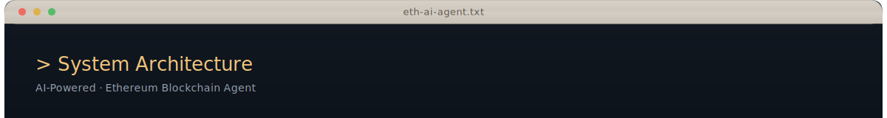
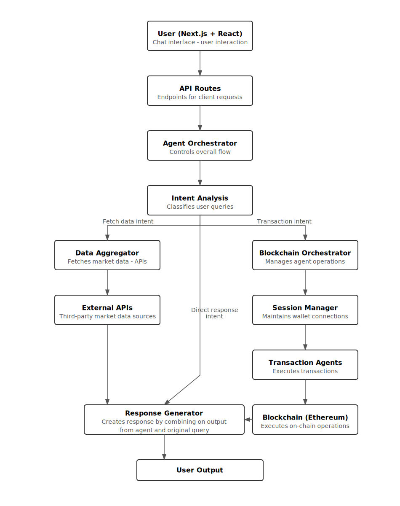

<div align="center">
  
</div>

<br>

## Overview

This application bridges natural language and Ethereum blockchain operations through an AI-powered conversational interface built on Next.js. Users interact in plain English to deploy smart contracts, transfer tokens, query market data, and monitor transactions, while the system handles intent classification, parameter extraction, wallet management, and blockchain execution behind a single chat endpoint.

The architecture prioritizes **intent-driven orchestration**, **provider-resilient data aggregation**, and **session-scoped wallet persistence**. The AI layer is not a wrapper around a blockchain SDK; it is a pipeline that classifies, validates, routes, and executes, with each stage independently testable and replaceable.

<br>

## Technology Stack

<table>
<tr>
<td><strong>Languages</strong></td>
<td>  </td>
</tr>
<tr>
<td><strong>Frontend</strong></td>
<td>   </td>
</tr>
<tr>
<td><strong>AI & NLP</strong></td>
<td> </td>
</tr>
<tr>
<td><strong>Blockchain</strong></td>
<td>   </td>
</tr>
<tr>
<td><strong>Data & APIs</strong></td>
<td>  </td>
</tr>
<tr>
<td><strong>Wallet</strong></td>
<td> </td>
</tr>
<tr>
<td><strong>Testing</strong></td>
<td> </td>
</tr>
</table>

<br>

## Engineering Principles

### 1. Natural language as the primary interface for complex operations

Users should never need to understand ABI encoding, gas estimation, or RPC semantics to deploy a contract or send tokens. The AI layer translates conversational intent into precise blockchain parameters. Technical complexity is the system's responsibility, not the user's.

> **Goal:** Reduce blockchain interaction to a conversation, without sacrificing correctness or safety.

### 2. Intent-driven pipeline separating NLP from execution

Intent classification, entity extraction, context enhancement, and blockchain execution are independent pipeline stages. The orchestrator routes classified intents to specialized agents (deployment, transfer, market data) without coupling the NLP model to any specific blockchain operation.

> **Goal:** Each stage can be tested, replaced, or extended independently. Adding a new blockchain action requires a new agent, not changes to the NLP layer.

### 3. Resilient data aggregation with explicit provider fallback

Market data flows through a prioritized provider chain (CoinGecko, then CoinMarketCap) with per-provider rate limiting, exponential backoff, and explicit error propagation. Fallback is a deliberate routing decision, not silent degradation.

> **Goal:** Users always receive the best available data. When a provider fails, the system tries alternatives rather than returning nothing, while making the data source visible.

### 4. Session-scoped wallet persistence across stateless boundaries

Wallet connections are maintained in a session manager that survives across individual API requests. The system supports browser wallets (MetaMask), server-side simulation, and mock wallets for testing, all behind a unified interface. Session state is scoped, not global.

> **Goal:** A user connects their wallet once and interacts across multiple requests without reconnection, regardless of the wallet provider.

### 5. Security validation as a gate, not an afterthought

Smart contract deployment passes through a security validator that checks for reentrancy vulnerabilities, tx.origin misuse, and other known attack patterns before compilation. Validation is a mandatory pipeline stage, not an optional lint step.

> **Goal:** No contract reaches the blockchain without passing security checks. The system prevents common vulnerabilities structurally.

---

## Critical Subsystems

<div align="center">


  
</div>

### AI Intent Pipeline

The core intelligence layer transforms natural language into structured blockchain operations through a multi-stage pipeline. `analyzeUserQuery()` sends the user's input to OpenAI for intent classification (MARKET_DATA, DEPLOY_CONTRACT, TRANSFER_TOKENS, CONNECT_WALLET, TRANSACTION_STATUS) and entity extraction (token names, addresses, amounts). A confidence score determines whether the system proceeds or asks for clarification.

The `AgentOrchestrator` receives the classified intent, enhances it with conversation context from the `ConversationStore`, and routes to the appropriate handler. Market data intents go to the aggregator pipeline. Blockchain intents are translated into structured `BlockchainActionParams` and dispatched to the `BlockchainOrchestrator`. Every query updates the conversation store, enabling contextual follow-ups ("What's the status of my last transaction?").

> **Guarantee:** No blockchain operation executes without a classified intent and extracted parameters. Ambiguous queries trigger clarification, not guesses.

<br>

### Blockchain Orchestration

The `BlockchainOrchestrator` routes validated blockchain actions to specialized agents:

*   **Contract Deployment Agent** — Selects from template library (ERC20, ERC721, SimpleStorage), customizes parameters from extracted entities, compiles Solidity on-the-fly, validates security, and submits the deployment transaction. Compilation errors return detailed feedback rather than silent failure.

*   **Token Transfer Agent** — Resolves token addresses via the token registry, validates recipient addresses, estimates gas, and submits transfer transactions. Supports both native ETH and ERC20 tokens through a unified interface.

*   **Transaction Monitor** — Registers all submitted transactions in a stateful registry with event-based status updates. Tracks the full lifecycle from submission through confirmation, providing real-time feedback to the conversation layer.

The `SessionManager` maintains wallet connections across API requests, abstracting the difference between MetaMask browser wallets, server-side simulation, and mock providers behind a consistent `WalletIntegrationService` interface.

> **Guarantee:** Every blockchain action flows through validation, session verification, and transaction registration. No orphaned transactions or untracked state changes.

<br>

### Market Data Aggregation

The aggregator pipeline fetches cryptocurrency data through a prioritized provider chain. CoinGecko is the primary source; CoinMarketCap serves as fallback. Each provider has independent rate limiting (configurable via environment variables), response caching, and error handling.

When the primary provider is rate-limited or returns an error, the system explicitly falls through to the next provider with exponential backoff. Partial results are surfaced with their source clearly attributed. The aggregator is stateless and side-effect-free, making it independently testable.

> **Guarantee:** Market data queries never silently fail. The response always attributes its data source, and fallback is an explicit routing decision.

<br>

### Conversation Context Management

The `ConversationStore` maintains per-session message history, detected topics, and learned user preferences (preferred tokens, technical level, interaction patterns). The `ContextBuilder` synthesizes this history into a structured context payload that enriches every AI query.

Context flows forward, not backward. New messages update the store; the store informs future responses. This enables multi-turn interactions ("Deploy a token" / "Call it SpaceToken" / "What's the status?") without requiring the user to repeat context.

> **Guarantee:** Conversation state is scoped to sessions, never leaked across users. Context enrichment improves responses without introducing statefulness into the pipeline stages themselves.

---

## Hardest Problems Solved

### 1. Bridging Natural Language Ambiguity to Precise Blockchain Parameters

**Problem:** Blockchain operations require exact parameters, addresses formatted as checksummed hex, amounts in wei precision, specific contract ABIs. Natural language is inherently ambiguous. "Send some ETH to my friend" contains no actionable blockchain parameters.

**Solution:** The intent pipeline uses OpenAI for classification and entity extraction with confidence scoring. When confidence falls below threshold, the system asks for clarification rather than guessing. Extracted entities are validated against blockchain constraints (address checksum, amount parsing, token resolution via registry) before reaching the execution layer. The orchestrator bridges the semantic gap between conversational intent and transaction parameters through structured `BlockchainActionParams` that are type-checked at every boundary.

### 2. Provider Fallback Without Silent Degradation

**Problem:** External market data APIs (CoinGecko, CoinMarketCap) have rate limits, outages, and inconsistent response formats. A naive fallback that silently switches providers hides data quality issues from the user and makes debugging impossible.

**Solution:** Each provider has an independent rate limiter with configurable thresholds. Fallback is an explicit routing decision, the system logs the switch, attributes the data source in the response, and propagates rate limit state across requests. Exponential backoff prevents thundering herd on recovery. When all providers fail, the error is propagated with a specific recovery suggestion rather than returning empty data.

### 3. Session-Scoped Wallet Persistence Across Stateless API Requests

**Problem:** Next.js API routes are stateless. Each request is an independent function invocation. But wallet connections require persistent state: the user connects once and expects subsequent requests to know about their wallet. Storing wallet state globally creates cross-session contamination.

**Solution:** The `SessionManager` maintains a session-indexed map of `WalletIntegrationService` instances. Each session gets an isolated wallet context that persists across requests but is scoped to that session. The interface is polymorphic: MetaMask connections store a reference to the browser wallet client, server-side connections use a fixed address, and mock mode provides deterministic behavior for testing. Session cleanup prevents memory leaks from abandoned sessions.

<br>

## Architectural Patterns

| Pattern | Implementation |
| :--- | :--- |
| **Intent-Driven Pipeline** | User input &rarr; OpenAI classification &rarr; entity extraction &rarr; agent routing &rarr; execution |
| **Specialized Agent Dispatch** | `BlockchainOrchestrator` routes to deployment, transfer, and monitoring agents by intent type |
| **Provider Fallback Chain** | CoinGecko &rarr; CoinMarketCap with per-provider rate limiting, backoff, and source attribution |
| **Session-Scoped State** | `SessionManager` maintains wallet connections indexed by session ID across stateless API routes |
| **Contract Security Gate** | Mandatory security validation (reentrancy, tx.origin, overflow) before any contract deployment |
| **Conversation Context Forward-Flow** | `ConversationStore` enriches future queries without introducing statefulness into pipeline stages |
| **Event-Based Transaction Lifecycle** | Transaction registry with event emitter for real-time status updates (pending &rarr; confirmed) |
| **Polymorphic Wallet Integration** | Unified `WalletIntegrationService` interface across MetaMask, server-side, and mock providers |

---

## Getting Started

### Prerequisites

- **Node.js >= 18**
- **OpenAI API Key**
- **Ethereum RPC Provider** (Alchemy, Infura, or local Hardhat node)
- Optional: CoinGecko API key, CoinMarketCap API key

### Quick Start

```bash
git clone https://github.com/adi2355/Eth-AI-Agent.git
cd Eth-AI-Agent
npm install
cp .env.example .env    # Add your API keys
npm run dev             # http://localhost:3000
```

### Environment Modes

| Mode | Config | Use Case |
| :--- | :--- | :--- |
| **Mock** | `USE_BLOCKCHAIN_MOCKS=true` | UI development, no real transactions |
| **Hardhat** | `USE_HARDHAT=true` | Local blockchain, free transactions |
| **Testnet** | `USE_TESTNET=true` | Sepolia testnet, real network conditions |
| **Mainnet** | All flags `false` | Production, real ETH required |

### Scripts

| Command | Purpose |
| :--- | :--- |
| `npm run dev` | Start development server |
| `npm run build` | Production build |
| `npm run blockchain:node` | Start local Hardhat node |
| `npm run blockchain:deploy` | Deploy contracts to local node |
| `npm run blockchain:test` | Run smart contract tests |
| `npm run test:agents` | Run AI agent tests |
| `npm run lint` | Code linting |

---

<details>
<summary><h2>Folder Structure</h2></summary>
<br>

```
.
├── app/                              # Next.js App Router
│   ├── api/
│   │   ├── auth/
│   │   │   ├── nonce/route.ts        # Nonce generation for wallet signing
│   │   │   └── verify/route.ts       # Signature verification
│   │   ├── blockchain/route.ts       # Blockchain operations endpoint
│   │   ├── blockchain-query/route.ts # Alternative blockchain queries
│   │   ├── chat/route.ts            # Main chat processing endpoint
│   │   └── token-data/route.ts      # Market data endpoint
│   ├── blockchain-test/page.tsx      # Direct blockchain testing UI
│   ├── layout.tsx                    # Root layout with providers
│   └── page.tsx                      # Main application page
├── components/
│   ├── ChatInterface.tsx             # Conversational chat UI
│   ├── ContractTemplateSelector.tsx  # Contract template picker
│   ├── ErrorBoundary.tsx             # Error handling boundary
│   ├── TransactionForm.tsx           # Token transfer form
│   └── ui/                           # ShadCN UI component library
├── lib/
│   ├── agents/
│   │   ├── blockchain-orchestrator.ts # Routes blockchain actions to agents
│   │   ├── intent.ts                 # OpenAI intent classification & entity extraction
│   │   ├── deployment/
│   │   │   ├── contract-deployment-agent.ts
│   │   │   ├── contract-templates.ts # ERC20, ERC721, SimpleStorage templates
│   │   │   └── solidity-compiler.ts  # On-the-fly Solidity compilation
│   │   ├── security/
│   │   │   └── contract-validator.ts # Vulnerability detection
│   │   ├── transaction/
│   │   │   └── token-transfer-agent.ts
│   │   ├── types.ts
│   │   └── validation.ts
│   ├── api/
│   │   ├── blockchain-api.ts         # Blockchain API client
│   │   └── transaction-api.ts        # Transaction tracking client
│   ├── blockchain/
│   │   ├── abis/erc20-abi.ts         # ERC20 ABI definition
│   │   ├── config.ts                 # Network & feature flag configuration
│   │   ├── mock-provider.ts          # Mock blockchain for testing
│   │   ├── providers.ts              # RPC client providers
│   │   ├── session-manager.ts        # Wallet session persistence
│   │   ├── token-registry.ts         # Token metadata registry
│   │   └── wallet-integration.ts     # Polymorphic wallet service
│   ├── conversation/
│   │   ├── context-builder.ts        # Context enhancement for AI queries
│   │   ├── context.ts                # Conversation context model
│   │   └── manager.ts                # Conversation state management
│   ├── orchestrator.ts               # Main query pipeline orchestrator
│   ├── conversation-store.ts         # Per-session message history
│   ├── token-data.ts                 # Market data aggregation
│   ├── rate-limit.ts                 # Per-provider rate limiting
│   └── utils.ts
├── contracts/                        # Solidity smart contracts
├── test/                             # Smart contract tests
├── tests/                            # AI agent tests
├── hardhat.config.ts
├── next.config.js
└── tsconfig.json
```

</details>

---

## Future Directions

| Direction | Description |
| :--- | :--- |
| **Multi-Chain Support** | Extend beyond Ethereum to Polygon, Arbitrum, and other EVM-compatible chains |
| **DeFi Protocol Integration** | Native support for Uniswap, Aave, and Compound operations via conversational commands |
| **On-Chain Analytics** | Historical data analysis, whale tracking, and social sentiment integration |
| **Enhanced Security Scanning** | Integration with external security auditors and automated gas optimization |
| **Persistent User Profiles** | Cross-session preference learning and personalized interaction patterns |

<br>

## License

MIT License. See [LICENSE](LICENSE) for details.

---

<div align="center">
  
</div>
