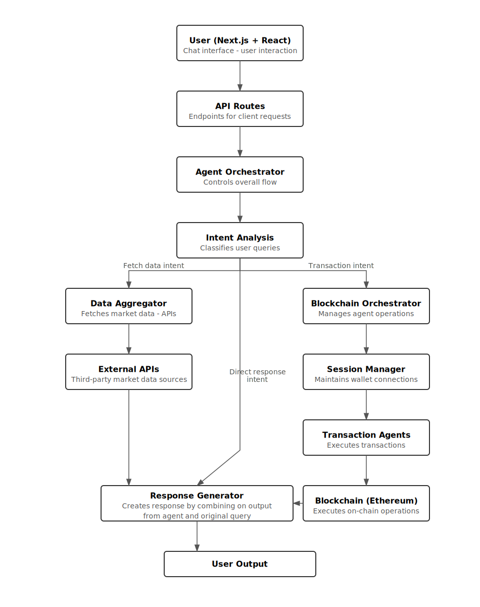

Ethereum AI Agent

<div align="center">


**An AI-powered conversational interface for blockchain interactions**

</div>

# 📋 Table of Contents


- [Overview](#overview)
- [Features](#features)
- [Architecture](#architecture)
- [Getting Started](#getting-started)
- [Environment Setup](#environment-setup)
- [Project Structure](#project-structure)
- [How It Works](#how-it-works)
- [Usage](#usage)
- [Testing](#testing)
- [Future Improvements](#future-improvements)
- [License](#license)


## 🌟 Overview

The Blockchain AI Agent is a next-generation application merging natural language processing with Ethereum blockchain functionality. It aims to reduce complexity for users interacting with blockchain technologies by offering a fluid, conversational interface that can:

- Fetch real-time cryptocurrency market data 
- Deploy smart contracts
- Transfer tokens
- Monitor transaction statuses
- Maintain contextual conversations
  

### How It Addresses Common Pain Points

- **Layered Complexity**: Simplifies advanced blockchain tasks by layering an AI chat interface over multiple technical components
- **Fragmented Data**: Aggregates market data from multiple providers in one place
- **Manual Wallet Operations**: Automates wallet interactions directly from the chat interface
- **Context Loss**: Maintains conversation flow to reduce repetitive instructions

## ✨ Features

### 1. Natural Language Intent Analysis

The agent uses advanced NLP to understand user queries, categorize intents, and extract relevant entities using OpenAI's capabilities.

- **Intent Classification**: Categorizes queries into specific intents like `MARKET_DATA`, `DEPLOY_CONTRACT`, `TRANSFER_TOKENS`, etc.
- **Entity Extraction**: Automatically identifies token names, addresses, amounts, and other parameters
- **Confidence Scoring**: Evaluates the certainty of interpretations and asks for clarification when needed
- **Ambiguity Resolution**: Handles unclear inputs by determining the most likely intent


### 2. Smart Contract Deployment

Deploy smart contracts directly through conversation, with built-in templating, compilation, and security validation.

- **Template Library**: Ready-to-use templates for ERC20, ERC721 (NFT), and SimpleStorage contracts
- **Parameter Customization**: Customize token name, symbol, supply, and other parameters via natural language
- **Real-time Compilation**: On-the-fly Solidity compilation with detailed error feedback
- **Security Validation**: Automatic checks for common vulnerabilities like reentrancy, tx.origin misuse, etc.


### 3. Token Transfers

Send ETH or ERC20 tokens with simple natural language commands, complete with transaction tracking.

- **Natural Language Processing**: Understand commands like "send 0.1 ETH to 0x123..."
- **Multi-Token Support**: Transfer ETH or any ERC20 token with automatic address validation
- **Transaction Tracking**: Monitor transaction status from submission to confirmation
- **Error Prevention**: Validation to prevent common mistakes like invalid addresses or insufficient funds


### 4. Persistent Wallet Connections

Maintain blockchain wallet connections across conversations with sophisticated session management.

- **Session-Based Architecture**: Store wallet connections in a session manager to maintain state
- **Cross-Request Persistence**: Keep wallet connected between different chat interactions
- **Environment Adaptability**: Support browser-based wallets (MetaMask) and server-side simulation
- **Mock Integration**: Testing-friendly mock wallet implementation with consistent behavior


### 5. Transaction Monitoring

Track blockchain transactions through their entire lifecycle with real-time status updates.

- **Stateful Transaction Registry**: Central record of all pending and completed transactions
- **Event-Based Updates**: Real-time status changes through event emitter architecture
- **Unified Interface**: Common API for both token transfers and contract deployments
- **Transaction History**: Persistent record of past transactions with detailed status information


### 6. Conversation Context & Personalization

The agent maintains conversation history and user preferences for context-aware responses.

- **Memory Storage**: Retains recent messages, topics, and user preferences
- **Preference Learning**: Identifies and remembers token preferences, technical level, and interests
- **Context Analysis**: Evaluates conversation flow for coherence and continuity
- **Personalized Responses**: Adapts responses based on user's previous interactions and knowledge level


### 7. Error Handling & API Fallbacks

Robust handling of errors with graceful fallbacks and retry mechanisms.

- **Provider Redundancy**: Automatic switching between CoinGecko and CoinMarketCap for market data
- **Exponential Backoff**: Smart retry logic for transient failures with increasing delays
- **Graceful Degradation**: Fallback mechanisms to provide partial results when possible
- **Detailed Error Reporting**: User-friendly error messages with specific recovery suggestions


## 🏗️ Architecture




### High-Level Flow

1. **User Query → /api/chat**
   - User's input is sent to the endpoint
   - Agent Orchestrator processes the query

2. **Intent Analysis**
   - OpenAI classifies the query's intent
   - Entities (addresses, tokens, amounts) are extracted

3. **Data Requirements / Blockchain Operations**
   - Market data queries go to the Aggregator
   - Blockchain activity routed to Blockchain Orchestrator

4. **Conversation Context**
   - ConversationStore maintains message history and preferences
   - Provides continuity across interactions

5. **Response Generation**
   - Final response formatted through OpenAI
   - Returned to user with relevant context

## 🚀 Getting Started

### Prerequisites

- **Node.js >= 18** (required for Next.js and ES modules)
- **npm or yarn** (package management)
- **OpenAI API Key** (for the conversational AI capabilities)
- **Ethereum RPC Provider** (Alchemy, Infura, or local Hardhat node)
- **Optional API Keys**:
  - CoinGecko API key (for market data with higher rate limits)
  - CoinMarketCap API key (for fallback market data)

### Installation Steps

1. **Clone the Repository**:
   ```bash
   git clone https://github.com/your-organization/blockchain-ai-agent.git
   cd blockchain-ai-agent
   ```

2. **Install Dependencies**:
   ```bash
   npm install
   ```

3. **Configure Environment Variables**:
   Create a `.env` file in the project root:

   ```bash
   cp .env.example .env
   ```

   Then edit the file to include your API keys and configuration:

   ```env
   # API Keys (required)
   OPENAI_API_KEY=your_openai_key_here
   
   # API Keys (optional but recommended)
   COINGECKO_API_KEY=your_coingecko_key
   COINMARKETCAP_API_KEY=your_coinmarketcap_key
   
   # Ethereum RPC URLs
   MAINNET_RPC_URL=https://eth-mainnet.g.alchemy.com/v2/your-api-key
   SEPOLIA_RPC_URL=https://eth-sepolia.g.alchemy.com/v2/your-api-key
   
   # Configuration options
   USE_BLOCKCHAIN_MOCKS=true    # Set to false for real blockchain transactions
   USE_HARDHAT=false            # Set to true to use local hardhat node
   USE_TESTNET=false            # Set to true to use Sepolia testnet
   ```

4. **Start a Local Blockchain (Optional)**:
   If you want to test with a local blockchain, open a separate terminal and run:

   ```bash
   npm run blockchain:node
   ```

   Then deploy test contracts to this local node:

   ```bash
   npm run blockchain:deploy
   ```

5. **Run Development Server**:
   ```bash
   npm run dev
   ```

   Access the application at http://localhost:3000

### Environment Configuration Options

The application can be configured to run in different modes:

- **Mock Mode** (`USE_BLOCKCHAIN_MOCKS=true`):
  - Simulates blockchain transactions without requiring a real node
  - Useful for UI testing and development
  - No real ETH or gas fees required

- **Local Hardhat Mode** (`USE_HARDHAT=true`):
  - Uses a local Ethereum node for testing real transactions
  - Requires running `npm run blockchain:node` in a separate terminal
  - Transactions are free but actual blockchain logic is executed

- **Testnet Mode** (`USE_TESTNET=true`):
  - Connects to Sepolia testnet for more realistic testing
  - Requires testnet ETH (can be obtained from faucets)
  - Tests with actual network conditions and gas fees

- **Mainnet Mode** (default when other options are false):
  - Connects to Ethereum mainnet for production use
  - Requires real ETH for gas fees
  - Use with caution - real funds will be spent

### Script Reference

#### Development Scripts

- `npm run dev`: Start development server with hot reload
  ```bash
  npm run dev
  ```

- `npm run build`: Build the application for production
  ```bash
  npm run build
  ```

- `npm run start`: Start the production build
  ```bash
  npm run start
  ```

- `npm run lint`: Check code linting
  ```bash
  npm run lint
  ```

#### Blockchain Scripts

- `npm run blockchain:node`: Spawn local Hardhat blockchain
  ```bash
  npm run blockchain:node
  ```
  
  Output:
  ```
  Started HTTP and WebSocket JSON-RPC server at http://127.0.0.1:8545/
  
  Accounts
  ========
  Account #0: 0xf39Fd6e51aad88F6F4ce6aB8827279cffFb92266 (10000 ETH)
  Private Key: 0xac0974bec39a17e36ba4a6b4d238ff944bacb478cbed5efcae784d7bf4f2ff80
  ...
  ```

- `npm run blockchain:deploy`: Deploy sample contracts to local node
  ```bash
  npm run blockchain:deploy
  ```

- `npm run blockchain:test`: Run contract-based tests
  ```bash
  npm run blockchain:test
  ```

#### Test Scripts

- `npm run test:agents`: Run AI agent logic tests
  ```bash
  npm run test:agents
  ```

### Verifying Installation

After starting the development server with `npm run dev`, you should:

1. Open http://localhost:3000 in your browser
2. See the chat interface loaded correctly
3. Try a simple query like "What is the price of Bitcoin?"
4. Verify the response contains current market data

For blockchain testing, navigate to http://localhost:3000/blockchain-test to:
- Connect a wallet (mock or real)
- Test token transfers
- Deploy contracts
- Monitor transaction statuses

## ⚙️ Environment Setup

The application can be configured through environment variables and configuration files to operate in different modes, connect to various networks, and use different API providers.

### Blockchain Configuration

The core blockchain settings are managed in `lib/blockchain/config.ts`:

```typescript
// From lib/blockchain/config.ts
// Environment detection
export const IS_DEVELOPMENT = process.env.NODE_ENV === 'development';
export const IS_TEST = process.env.NODE_ENV === 'test';
export const IS_BROWSER = typeof window !== 'undefined';
export const IS_SERVER = !IS_BROWSER;

// Feature flags (can be overridden by environment variables)
export const USE_MOCKS = process.env.USE_BLOCKCHAIN_MOCKS === 'true' || IS_TEST;
export const USE_HARDHAT = process.env.USE_HARDHAT === 'true' || (IS_DEVELOPMENT && !USE_MOCKS);
export const USE_TESTNET = process.env.USE_TESTNET === 'true' || (!IS_DEVELOPMENT && !IS_TEST);

// Network configuration
export const DEFAULT_NETWORK = USE_TESTNET ? 'sepolia' : (USE_HARDHAT ? 'localhost' : 'mainnet');
export const DEFAULT_CHAIN_ID = getChainIdForNetwork(DEFAULT_NETWORK);

// RPC URLs
export const RPC_URLS: Record<string, string> = {
  mainnet: process.env.MAINNET_RPC_URL || 'https://eth-mainnet.g.alchemy.com/v2/demo',
  sepolia: process.env.SEPOLIA_RPC_URL || 'https://eth-sepolia.g.alchemy.com/v2/demo',
  localhost: 'http://127.0.0.1:8545',
};
```

### Network Configuration Options

#### 1. Local Development with Hardhat

For a completely self-contained development environment:

```env
USE_BLOCKCHAIN_MOCKS=false
USE_HARDHAT=true
USE_TESTNET=false
```

Setup steps:
1. Start Hardhat in a separate terminal:
   ```bash
   npm run blockchain:node
   ```

2. Deploy test contracts:
   ```bash
   npm run blockchain:deploy
   ```

3. Interact with contracts using the consistent test accounts:
   ```
   Account #0: 0xf39Fd6e51aad88F6F4ce6aB8827279cffFb92266
   Private Key: 0xac0974bec39a17e36ba4a6b4d238ff944bacb478cbed5efcae784d7bf4f2ff80
   ```

Code example for local hardhat configuration:
```typescript
// Connect to local hardhat node
const provider = new ethers.JsonRpcProvider('http://127.0.0.1:8545');
const wallet = new ethers.Wallet('0xac0974bec39a17e36ba4a6b4d238ff944bacb478cbed5efcae784d7bf4f2ff80', provider);
```

#### 2. Testnet Development (Sepolia)

For testing in a public testnet environment:

```env
USE_BLOCKCHAIN_MOCKS=false
USE_HARDHAT=false
USE_TESTNET=true
SEPOLIA_RPC_URL=https://eth-sepolia.g.alchemy.com/v2/your-api-key
```

Setup steps:
1. Obtain a Sepolia RPC URL (from Alchemy, Infura, etc.)
2. Get test ETH from a Sepolia faucet
3. Use MetaMask or a similar wallet connected to Sepolia

#### 3. Production (Mainnet)

For production deployment with real funds:

```env
USE_BLOCKCHAIN_MOCKS=false
USE_HARDHAT=false
USE_TESTNET=false
MAINNET_RPC_URL=https://eth-mainnet.g.alchemy.com/v2/your-api-key
```

### Wallet Connection Methods

#### 1. Mock Wallet

For development without real blockchain:

```env
USE_BLOCKCHAIN_MOCKS=true
```

The mock wallet system simulates blockchain interactions:

```typescript
// From lib/blockchain/mock-provider.ts
export function mockSendTransaction(options: any): Promise<`0x${string}`> {
  return new Promise((resolve) => {
    setTimeout(() => {
      // Generate mock transaction hash
      const txHash = `0x${Math.floor(Math.random() * 10**16).toString(16).padStart(64, '0')}` as `0x${string}`;
      
      // Record the transaction
      mockTransactions.set(txHash, {
        hash: txHash,
        to: options.to,
        from: mockAddress,
        value: options.value || BigInt(0),
        data: options.data || '0x',
        status: 'pending',
        timestamp: Date.now(),
        // Additional fields...
      });
      
      // Start confirmation simulation
      simulateConfirmations(txHash);
      
      resolve(txHash);
    }, 1000); // Simulate network delay
  });
}
```

#### 2. Browser Wallet (MetaMask)

For connecting to real wallets in the browser:

```env
USE_BLOCKCHAIN_MOCKS=false
```

The wallet connection flow:

```typescript
// From lib/blockchain/wallet-integration.ts
async connect(type: WalletType = 'metamask',
              options: WalletConnectionOptions = { type: 'metamask' }): Promise<`0x${string}`> {
  // For browser environments
  if (typeof window !== 'undefined') {
    if (!window.ethereum) {
      throw new Error('MetaMask not detected in browser');
    }
    
    this.walletClient = createWalletClient({
      chain,
      transport: custom(window.ethereum)
    });
    
    // Request accounts
    const accounts = await this.walletClient.requestAddresses();
    if (!accounts || accounts.length === 0) {
      throw new Error('No accounts found in MetaMask');
    }
    
    this.connectedAddress = accounts[0];
    return this.connectedAddress;
  }
  
  // For server environments, return a placeholder address
  return '0x0000000000000000000000000000000000000000';
}
```

#### 3. Server-Side Simulation

For testing in server environments:

```typescript
// From lib/blockchain/session-manager.ts
if (typeof window === 'undefined') {
  // Use a fixed address for server-side connections
  const serverAddress = '0x87a89B578e769F172440581A4E3DE6823dd116bB' as `0x${string}`;
  const walletService = new WalletIntegrationService();
  walletService.setMockAddress(serverAddress);
  
  // Register in session manager
  this.storeConnection(sessionId, walletService, serverAddress);
  return serverAddress;
}
```

### External API Configuration

#### 1. OpenAI Setup

Configure the OpenAI integration:

```env
OPENAI_API_KEY=your-openai-api-key-here
OPENAI_MODEL=gpt-4o-mini  # Optional, defaults to gpt-4o-mini
```

The OpenAI client is initialized in `lib/agents/intent.ts`:

```typescript
function getOpenAIClient() {
  if (!openai) {
    const apiKey = process.env.OPENAI_API_KEY;
    if (!apiKey) {
      throw new Error('OpenAI API key is not configured');
    }
    
    const configuration = new Configuration({ apiKey });
    openai = new OpenAIApi(configuration);
  }
  return openai;
}
```

#### 2. Market Data APIs

Configure the market data providers:

```env
COINGECKO_API_KEY=your-coingecko-api-key
COINMARKETCAP_API_KEY=your-coinmarketcap-api-key
COINGECKO_RATE_LIMIT=50  # Optional, requests per minute
COINMARKETCAP_RATE_LIMIT=30  # Optional, requests per minute
```

The market data services automatically handle rate limiting and fallbacks:

```typescript
// From lib/token-data.ts
export async function getTokenDetails(query: string): Promise<TokenInfo | null> {
  try {
    // Try CoinGecko first
    if (canCallCoinGecko()) {
      try {
        const response = await fetchCoinGecko(/* ... */);
        // Process and return data..
    
    // Fallback to CoinMarketCap
    if (canCallCoinMarketCap()) {
      try {
        const data = await fetchCoinMarketCap(/* ... */);

```

### Custom Configuration

To extend the environment setup:

1. Modify `.env` for basic configuration
2. Edit `lib/blockchain/config.ts` for blockchain settings
3. Edit `lib/env-config.ts` for API configurations
4. Update `hardhat.config.ts` for local blockchain settings

## 📁 Project Structure

The project follows a modular architecture, organizing code by domain and responsibility:

```
.
├── app/                             # Next.js App Router structure
│   ├── api/                         # API routes (server-side)
│   │   ├── auth/                    # Authentication endpoints
│   │   │   ├── nonce/route.ts       # Nonce generation for wallet signing
│   │   │   └── verify/route.ts      # Signature verification
│   │   ├── blockchain/route.ts      # Blockchain operations endpoint
│   │   ├── blockchain-query/route.ts # Alternative blockchain endpoint
│   │   ├── chat/route.ts            # Main chat processing endpoint
│   │   └── token-data/route.ts      # Market data endpoint
│   ├── blockchain-test/             # Test page for blockchain operations
│   │   └── page.tsx                 # UI for direct blockchain testing
│   ├── layout.tsx                   # Root layout with providers
│   └── page.tsx                     # Main application page
│
├── components/                      # React components
│   ├── ChatInterface.tsx            # Main chat UI component
│   ├── ContractTemplateSelector.tsx # Contract template selection modal
│   ├── ErrorBoundary.tsx            # Error handling component
│   ├── TransactionForm.tsx          # Transaction input form
│   └── ui/                          # UI component library (ShadCN)
│
├── lib/                             # Core application logic
│   ├── agents/                      # AI agent and processing modules
│   │   ├── blockchain-orchestrator.ts # Routes blockchain actions
│   │   ├── deployment/              # Contract deployment modules
│   │   │   ├── contract-deployment-agent.ts # Deployment logic
│   │   │   ├── contract-templates.ts # Contract template definitions
│   │   │   └── solidity-compiler.ts # Solidity compilation
│   │   ├── intent.ts                # Intent classification with OpenAI
│   │   ├── security/                # Security validation
│   │   │   └── contract-validator.ts # Contract security checks
│   │   ├── transaction/             # Transaction handling
│   │   │   └── token-transfer-agent.ts # Token transfer logic
│   │   ├── types.ts                 # Shared type definitions
│   │   └── validation.ts            # Input validation logic
│   │
│   ├── api/                         # API client libraries
│   │   ├── blockchain-api.ts        # Client for blockchain endpoints
│   │   └── transaction-api.ts       # Transaction tracking API
│   │
│   ├── blockchain/                  # Blockchain integration
│   │   ├── abis/                    # Contract ABIs
│   │   │   └── erc20-abi.ts         # ERC20 interface definition
│   │   ├── config.ts                # Blockchain configuration
│   │   ├── mock-provider.ts         # Mock blockchain provider
│   │   ├── providers.ts             # RPC client providers
│   │   ├── session-manager.ts       # Wallet session management
│   │   ├── token-registry.ts        # Token metadata registry
│   │   └── wallet-integration.ts    # Wallet connection service
│   │
│   ├── conversation/                # Conversation management
│   │   ├── context-builder.ts       # Context enhancement
│   │   ├── context.ts               # Conversation context model
│   │   └── manager.ts               # Conversation state manager
│   │
│   ├── aggregator.ts                # External data aggregation
│   ├── auth.ts                      # Authentication functions
│   ├── blockchain.ts                # High-level blockchain functions
│   ├── conversation-store.ts        # Conversation state storage
│   ├── env-config.ts                # Environment configuration
│   ├── llm.ts                       # LLM integration utilities
│   ├── middleware.ts                # API middleware functions
│   ├── orchestrator.ts              # Main query orchestration
│   ├── rate-limit.ts                # API rate limiting
│   ├── session-utils.ts             # Session management
│   ├── token-data.ts                # Cryptocurrency data functions
│   └── utils.ts                     # General utilities
│
├── contracts/                       # Smart contract source code
│   ├── ERC20.sol                    # ERC20 token implementation
│   └── NFT.sol                      # NFT contract implementation
│
├── hardhat.config.ts                # Hardhat blockchain configuration
├── middleware.ts                    # Next.js global middleware
├── next.config.js                   # Next.js configuration
├── package.json                     # Project dependencies and scripts
├── tailwind.config.ts               # Tailwind CSS configuration
├── tsconfig.json                    # TypeScript configuration
└── .env.example                     # Example environment variables
```

### Key Module Relationships

#### API & Client Flow

```
User Input → app/api/chat/route.ts → lib/orchestrator.ts → lib/agents/* → Response
                                          ↑
                                          | (if blockchain action needed)
                                          ↓
                  app/api/blockchain/route.ts → lib/agents/blockchain-orchestrator.ts
```

#### Component & UI Organization

The UI components are structured hierarchically:

```
page.tsx
   ↓
ChatInterface.tsx  ←→  components/ui/*
   ↓
TransactionForm.tsx
ContractTemplateSelector.tsx
ErrorBoundary.tsx
```

#### Core Business Logic

The agent architecture follows a pipeline pattern:

```typescript
// From lib/orchestrator.ts - Processing pipeline
async processQuery(query: string, sessionId?: string): Promise<OrchestrationResult> {
  try {
    // Step 1: Intent Analysis
    const analysis = await analyzeUserQuery({ query });
    
    // Step 2: Build conversation context
    const enhancedContext = buildEnhancedContext(sessionId, analysis);
    
    // Step 3: Process based on intent type
    let aggregatorData: AggregatorResult | null = null;
    
    if (isBlockchainIntent(analysis.classification.primaryIntent)) {
      // Handle blockchain actions
      const blockchainParams = this.extractBlockchainParams(analysis, query);
      const blockchainResult = await blockchainOrchestrator.handleAction(blockchainParams);
      aggregatorData = { primary: { blockchain: blockchainResult } };
    } 
    else if (analysis.classification.needsApiCall) {
      // Handle market data queries
      const aggregatorSpec = await buildAggregatorCalls(analysis);
      aggregatorData = await executeAggregatorCalls(aggregatorSpec);
    }
    
    // Step 4: Generate final response
    const response = await generateSummary({
      userQuery: query,
      analysis,
      aggregatorResult: aggregatorData,
      sessionId,
      enhancedContext: formattedContext
    });
    
    // Step 5: Update conversation history
    ConversationStore.addMessage(sessionId, {
      role: 'assistant',
      content: response,
      timestamp: Date.now(),
      metadata: {
        intent: analysis.classification.primaryIntent,
        tokens: analysis.queryAnalysis.detectedTokens
      }
    });
    
    return {
      analysis,
      aggregatorData,
      response,
      suggestions: this.generateSuggestions(analysis, enhancedContext)
    };
  } catch (error) {
    // Error handling...
  }
}
```

### Key File Responsibilities

#### 1. Core Orchestration

- **`lib/orchestrator.ts`**: Main controller that processes queries through the AI pipeline
- **`lib/conversation-store.ts`**: Manages conversation history and context for personalization
- **`lib/agents/intent.ts`**: Analyzes user queries with OpenAI to determine intent and extract entities

```typescript
// Example from lib/orchestrator.ts
export class AgentOrchestrator {
  // Process a user's natural language query
  async processQuery(query: string, sessionId?: string): Promise<OrchestrationResult> {
    // Implementation described above
  }
  
  // Generate contextual follow-up suggestions
  private generateSuggestions(analysis: RobustAnalysis, enhancedContext: any): string[] {
    // Create personalized suggestions based on conversation history
  }
  
  // Extract blockchain parameters from analysis
  private extractBlockchainParams(analysis: RobustAnalysis, query: string): BlockchainActionParams {
    // Convert analysis to structured blockchain parameters
  }
}
```

#### 2. Blockchain Integration

- **`lib/agents/blockchain-orchestrator.ts`**: Routes and executes blockchain actions
- **`lib/blockchain/session-manager.ts`**: Maintains wallet connections across API requests
- **`lib/agents/transaction/token-transfer-agent.ts`**: Handles token transfer operations
- **`lib/agents/deployment/contract-deployment-agent.ts`**: Manages contract deployments

```typescript
// Example from lib/agents/blockchain-orchestrator.ts
export class BlockchainOrchestrator {
  // Handle different blockchain action types
  async handleAction(params: BlockchainActionParams): Promise<BlockchainActionResult> {
    try {
      const sessionId = params.sessionId || 'default-session';
      
      switch (params.actionType) {
        case 'CONNECT_WALLET':
          return await this.connectWallet(sessionId, params.walletParams!);
          
        case 'DEPLOY_CONTRACT':
          return await this.deployContract(sessionId, params.deploymentParams!);
          
        case 'TRANSFER_TOKENS':
          return await this.transferTokens(sessionId, params.transferParams!);
          
        // Additional action types...
      }
    } catch (error) {
      // Error handling...
    }
  }
}
```

#### 3. UI Components

- **`components/ChatInterface.tsx`**: Main chat interface with message history, input, and suggestions
- **`components/TransactionForm.tsx`**: Form for token transfer parameters
- **`components/ContractTemplateSelector.tsx`**: Modal for selecting contract templates

```typescript
// Example from components/ChatInterface.tsx
export function ChatInterface() {
  const [messages, setMessages] = useState<Message[]>([]);
  const [input, setInput] = useState('');
  const [sessionId, setSessionId] = useState<string>('default-session');
  
  // Handle user submissions
  const handleSubmit = async (e: React.FormEvent | string, isRetry = false) => {
    // Process the query through the API
    const response = await fetch('/api/chat', {
      method: 'POST',
      headers: { 'Content-Type': 'application/json' },
      body: JSON.stringify({
        query: queryText,
        sessionId: sessionId
      }),
    });
    
    // Update UI with response
  };
  
  // Render chat interface
  return (
    <Card className="h-[calc(100vh-12rem)]">
      <CardHeader className="border-b">
        <CardTitle>Blockchain Assistant</CardTitle>
      </CardHeader>
      <CardContent className="flex flex-col h-[calc(100%-5rem)]">
        <div className="flex-1 overflow-y-auto space-y-4 mb-4 p-4">
          {/* Messages rendering */}
        </div>
        <div className="border-t pt-4 px-4">
          <form onSubmit={handleSubmit} className="flex gap-2">
            {/* Input controls */}
          </form>
        </div>
      </CardContent>
    </Card>
  );
}
```

#### 4. API Routes

- **`app/api/chat/route.ts`**: Main API endpoint for processing chat queries
- **`app/api/blockchain/route.ts`**: API endpoint for blockchain operations

```typescript
// Example from app/api/chat/route.ts
export async function POST(req: Request) {
  try {
    const { query, sessionId } = await req.json();
    
    if (!query?.trim()) {
      return NextResponse.json(
        { error: 'Query is required' },
        { status: 400, headers: corsHeaders }
      );
    }

    // Process the query through the orchestrator
    const result = await orchestrator.processQuery(query, sessionId);

    return NextResponse.json(result);
  } catch (error) {
    // Error handling...
  }
}
```

### Directory Organization Philosophy

1. **Domain-Driven Design**: Code is organized by domain (agents, blockchain, conversation)
2. **Separation of Concerns**: UI components are isolated from business logic
3. **Feature Modularity**: Features can be added by extending specific modules
4. **API Consistency**: API routes expose consistent interfaces to the frontend
5. **Service Pattern**: Core functionality is implemented as services with clear responsibilities

## 🔄 How It Works

The Blockchain AI Agent processes user queries through a sophisticated pipeline that combines natural language understanding, context management, and blockchain operations. Let's explore how different types of requests flow through the system.

### Processing Pipeline Overview

```
User Input → Intent Analysis → Context Enhancement → 
  ├─ Market Data Queries → External APIs → Data Processing
  └─ Blockchain Actions → Wallet Operations → Transaction Monitoring
    → Response Generation → UI Rendering
```

### End-to-End Flow Examples

#### Example 1: Contract Deployment

Let's walk through the flow of a request to "Deploy an ERC20 token called MyToken with symbol MTK and supply of 1,000,000":

1. **User Query Submission**

2. **Intent Analysis with OpenAI**

3. **Conversation Context Enhancement**

4. **Parameter Extraction & Blockchain Action**

5. **Contract Template Processing**

6. **Contract Compilation & Deployment**

7. **Transaction Registration & Monitoring**

8. **Response Generation**

9. **Transaction Status Updates**

10. **UI Updates via Events**

   

#### Example 2: Market Data Query

For a query like "What is the current price of Bitcoin?":

1. **Intent Classification**
   

2. **Aggregator API Calls**
   

3. **Response Generation**
   ```typescript
   // Specialized response for price data
   function generateTokenPriceResponse(tokenName: string, data: any): string {
     return `### Current ${tokenName} Price Data

**Price**: ${data.current_price.toFixed(6)}
**24h Change**: ${data.price_change_percentage_24h.toFixed(2)}%
**Market Cap**: ${formatMarketCap(data.market_cap)}

*Data source: ${data.source}*

Would you like to:
- See detailed market metrics?
- Compare with other tokens?
- View historical price data?`;
   }
   ```


### Data Flow Diagrams

#### Token Transfer Flow

```
User → "Send 0.1 ETH to 0xabc123..."
  ↓
Intent Analysis → TRANSFER_TOKENS + Extract parameters
  ↓
Session Manager → Get wallet for session
  ↓
TokenTransferAgent → Create transaction
  ↓
Wallet Service → Sign and send transaction
  ↓
Transaction Registry → Record pending transaction
  ↓
Background Monitor → Wait for confirmations
  ↓
Transaction Events → Notify about status changes
  ↓
UI Updates → Show confirmation to user
```

#### Market Data Flow

```
User → "What's the price of Bitcoin?"
  ↓
Intent Analysis → MARKET_DATA + Extract token(s)
  ↓
Aggregator → Determine APIs to call
  ↓
CoinGecko API → Attempt primary fetch
  ↓
  ├─ Success → Process price data
  │            ↓
  │            Response Generation → Format price response
  │
  └─ Rate limit/error → Fallback to CoinMarketCap API
                        ↓
                        Process alternative data source
                        ↓
                        Response Generation → Format with fallback data
```

## 🖥️ Usage

The Blockchain AI Agent provides two primary interfaces for interacting with blockchain functionality: the conversational Chat Interface and the specialized Blockchain Test Page.

### Main Chat Interface

Access the main application at **http://localhost:3000** after starting the development server. This interface allows natural language interactions with blockchain functionality.

#### 1. Cryptocurrency Price Queries

Get real-time market data for any cryptocurrency:

```
> What is the current price of Ethereum?

Current Ethereum Price Data:
Price: $3,476.82
24h Change: +2.14%
Market Cap: $418.5B
Volume (24h): $14.2B

Data source: CoinGecko
```

```
> Compare Bitcoin and Ethereum prices

Bitcoin vs. Ethereum Comparison:

Bitcoin (BTC):
- Price: $61,241.53
- 24h Change: +0.87%
- Market Cap: $1.2T

Ethereum (ETH):
- Price: $3,476.82
- 24h Change: +2.14%
- Market Cap: $418.5B

ETH/BTC Ratio: 0.0567
```

#### 2. Wallet Connection

Connect your cryptocurrency wallet directly from the chat:

```
> Connect my wallet

To connect your wallet, please click the "Connect Wallet" button in the top-right corner of the interface. You'll need to approve the connection request in your wallet extension.

[After connection completes]

✅ Wallet connected successfully!
Address: 0x742d...f44e

You can now perform blockchain operations like deploying contracts and sending transactions.
```

#### 3. Token Transfers

Send cryptocurrency to any address:

```
> Send 0.01 ETH to 0x742d35Cc6634C0532925a3b844Bc454e4438f44e

I'll help you send 0.01 ETH to the address 0x742d...f44e.

Please confirm the transaction details:
- Amount: 0.01 ETH
- Recipient: 0x742d...f44e
- Estimated gas fee: 0.0005 ETH

[Confirm] [Cancel]

[After confirmation]

💸 Transaction sent!
Transaction hash: 0x82a5...c734

Your transaction is being processed. This typically takes 15-60 seconds to confirm.
```

#### 4. Contract Deployment

Deploy custom smart contracts through natural language:

```
> Deploy an ERC20 token called SpaceToken with symbol SPACE

I'll help you deploy an ERC20 token called "SpaceToken" with symbol "SPACE".

Please provide the following details:
- Initial supply: 1000000
- Decimals: 18

[Deploy Contract] [Cancel]

[After deployment confirmation]

🚀 Contract deployment initiated!
Transaction hash: 0x7f12...e93a

Your token contract is being deployed to the blockchain. This typically takes 15-60 seconds to confirm.

[After confirmation]

✅ Contract deployed successfully!
SpaceToken (SPACE) is now available at address: 0x9876...abcd
```

#### 5. Following Transaction Status

Track the status of pending transactions:

```
> What's the status of my last transaction?

I found your most recent transaction:

Transaction: Token Transfer
Hash: 0x82a5...c734
Status: Confirmed (12 blocks)
Time: 2 minutes ago
Gas used: 21,000

The transaction has been successfully confirmed on the blockchain.
```

### Blockchain Test Page

For more direct blockchain interactions, visit **http://localhost:3000/blockchain-test**. This specialized interface provides detailed controls for blockchain operations:

#### Features:

1. **Wallet Management**
   - Connect to MetaMask or other providers
   - View wallet address and status
   - Test with mock wallets in development

2. **Token Transfer Interface**
   - Specify recipient address
   - Set exact amounts
   - Support for ETH and custom tokens
   - Direct transaction submission

3. **Contract Deployment Panel**
   - Select from available templates (ERC20, ERC721, etc.)
   - Configure parameters (name, symbol, supply)
   - One-click deployment
   - Security validation

4. **Transaction History**
   - View all transactions in chronological order
   - Monitor transaction status in real-time
   - Detailed information about each transaction
   - Filter by transaction type

5. **Debug Tools**
   - Direct access to transaction data
   - Status refreshing
   - Transaction acceleration options

### Using the API Directly

For programmatic access, you can interact with the API endpoints directly:

#### Chat Endpoint

```typescript
// Process a query through the AI pipeline
fetch('/api/chat', {
  method: 'POST',
  headers: { 'Content-Type': 'application/json' },
  body: JSON.stringify({
    query: "What is the price of Ethereum?",
    sessionId: "user-session-123"
  })
})
.then(response => response.json())
.then(data => console.log(data.response));
```

#### Blockchain Endpoint

```typescript
// Execute a blockchain operation
fetch('/api/blockchain', {
  method: 'POST',
  headers: { 'Content-Type': 'application/json' },
  body: JSON.stringify({
    action: {
      actionType: 'TRANSFER_TOKENS',
      transferParams: {
        to: '0x742d35Cc6634C0532925a3b844Bc454e4438f44e',
        amount: '0.01',
        tokenAddress: null // null for ETH
      }
    },
    sessionId: "user-session-123"
  })
})
.then(response => response.json())
.then(data => console.log(data));
```

## 🧪 Testing

The project includes a comprehensive testing setup for both the AI functionality and blockchain interactions, ensuring reliability across all layers of the application.

### AI Agent Testing

Test the natural language processing and reasoning capabilities:

```bash
npm run test:agents
```

This runs the tests in `tests/agent-tests.ts` which verify:

- Intent classification accuracy
- Entity extraction reliability
- Response generation quality
- Error handling robustness


### Blockchain Contract Testing

Test smart contract functionality and deployment logic:

```bash
# First terminal: Start a local Hardhat blockchain
npm run blockchain:node

# Second terminal: Run contract tests
npm run blockchain:test
```

This executes tests in `test/contracts/` which verify:

- Contract deployment success
- Contract functionality (transfers, approvals, etc.)
- Edge cases and error conditions
- Gas optimization


### Integration Testing

For comprehensive end-to-end testing, follow these steps:

#### 1. Start the Test Environment

```bash
# Terminal 1: Start local blockchain
npm run blockchain:node

# Terminal 2: Deploy test contracts
npm run blockchain:deploy

# Terminal 3: Start the development server
npm run dev
```

#### 2. Test UI Flows

Navigate to http://localhost:3000/blockchain-test and verify:

1. **Wallet Connection Flow**
   - Click "Connect Wallet"
   - Approve connection in MetaMask (or use mock wallet)
   - Verify wallet address appears in UI

2. **Token Transfer Flow**
   - Select the "Transfer" tab
   - Enter a recipient address
   - Specify an amount (e.g., 0.01 ETH)
   - Submit the transaction
   - Verify transaction appears in history tab
   - Verify status updates from "Pending" to "Confirmed"

3. **Contract Deployment Flow**
   - Select the "Deploy Contract" tab
   - Choose "ERC20 Token" template
   - Configure token parameters
   - Deploy the contract
   - Verify deployment status in transaction history
   - Verify contract address is displayed after confirmation

#### 3. Test Chat Interface

Navigate to http://localhost:3000 and verify:

1. **Market Data Queries**
   - Type "What is the price of Bitcoin?"
   - Verify response contains current price data
   - Try comparison: "Compare ETH and BTC"

2. **Conversational Blockchain Operations**
   - Type "Connect my wallet" and verify wallet connects
   - Type "Deploy an ERC20 token called TestToken"
   - Follow the deployment flow
   - Verify transaction appears in response
   - Type "What's the status of my deployment?" to test context

### Mock vs. Real Testing

The system supports both mock and real blockchain testing:

#### Mock Mode Testing

Set in `.env`: `USE_BLOCKCHAIN_MOCKS=true`

Benefits:
- No real ETH required
- Faster test execution
- Predictable behavior
- Works without wallet extensions


#### Real Network Testing

For testing with real networks:

1. **Local Hardhat**: Fast, free, but needs local node
   - Set `USE_HARDHAT=true` in `.env`
   - Use test accounts with pre-funded ETH

2. **Testnet (Sepolia)**:  
   - Set `USE_TESTNET=true` in `.env`
   - Get test ETH from a faucet like https://sepoliafaucet.com/
   - Connect MetaMask to Sepolia network

### Automated Testing with CI/CD

For continuous integration, configure GitHub Actions to:
- Run `npm run test:agents` for AI testing
- Start a Hardhat node and run `npm run blockchain:test`
- Run linting and type checking

Sample CI configuration is available in `.github/workflows/`.

## 🔮 Future Improvements

The Blockchain AI Agent has a robust roadmap for future enhancements. Below are the key planned improvements with implementation details:

### 1. Multi-Chain Support

Extend beyond Ethereum to support multiple blockchains:

Implementation priorities:
- Add configurations for each chain
- Implement chain-specific transaction handling
- Create UI for chain selection
- Support cross-chain data aggregation

### 2. DeFi Protocol Integrations

Built-in integrations with popular DeFi protocols:

Implementation priorities:
- Create protocol adaptors for major platforms
- Implement position aggregation across chains
- Add natural language commands for DeFi operations
- Build visualizations for DeFi positions

### 3. Advanced Data Analytics

Enhanced on-chain analysis capabilities:

Implementation priorities:
- Integrate with on-chain data providers
- Add social sentiment analysis
- Create visualization components
- Add historical data analysis

### 4. Smart Contract Security Enhancements

More sophisticated security validation:

Implementation priorities:
- Integrate with security scanners
- Implement code pattern analysis
- Add gas optimization suggestions
- Create security reporting UI


### 6. Enhanced Context Memory

Improved user preference and interaction memory:

Implementation priorities:
- Create persistent user profiles
- Implement preference learning algorithms
- Add personalized suggestions
- Support cross-device profile sync


## 📄 License

This project is distributed under the MIT License. See [LICENSE](LICENSE) for more information.

---

<div align="center">
  <p>Built with ❤️ </p>
</div>
